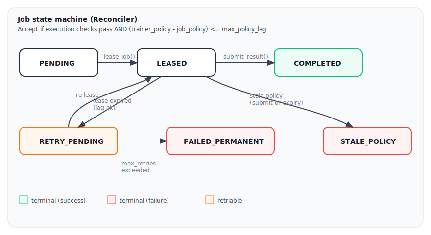
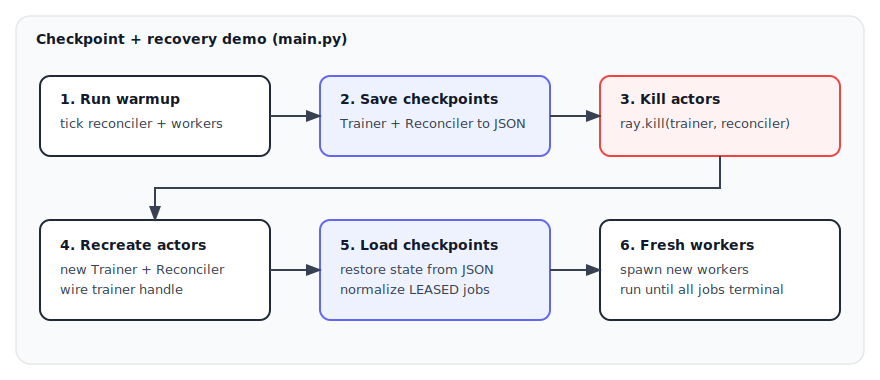

# async-rollout (learning project)

This repo is a tiny “async RL rollout” simulator built on **Ray actors**. It’s meant to help you learn the core moving parts of asynchronous rollouts: **job leasing**, **late results**, **policy version drift**, **stale-policy rejection**, and **checkpoint/recovery**.

## What runs

- **`RolloutWorker`** (`worker.py`): loops forever: heartbeat → lease a job → sleep (fast 70% / long 30%) → submit a `RolloutResult`.
- **`Reconciler`** (`reconciler.py`): owns the authoritative job table, decides whether a result is accepted, expires leases, and triggers retries or stale-policy drops.
- **`Trainer`** (`trainer.py`): receives accepted rollouts, increments `num_rollouts_received`, and bumps `current_policy_version` every `train_every` accepted rollouts.
- **Driver** (`main.py`): wires actors together, shows a progress bar, and optionally does a scripted “save → kill → recreate → load → continue” recovery demo.

## Diagrams

### Actor topology


### Job lifecycle (state machine)



### Checkpoint + recovery demo



## Key concepts (mapped to code)

- **Job leasing**: `Reconciler.lease_job()` marks a job `LEASED` and sets `lease_expiry`.
- **Accept/reject**: `Reconciler.submit_result()` enforces basic execution checks (job exists, still `LEASED`, attempt matches, worker matches).
- **Policy lag window**: if a trainer is attached, accept results only when:

  \[
  (trainer\_policy\_version - job.policy\_version) \le max\_policy\_lag
  \]

  Otherwise the job becomes `STALE_POLICY` and the result is rejected.

- **Lease expiry → retry vs stale**: `Reconciler.tick()` expires leases. Expired leased jobs become:
  - `STALE_POLICY` if lag is too large
  - else `RETRY_PENDING` (until `max_retries` is exceeded)

- **Trainer versioning (`train_every`)**: in `Trainer.submit_rollout()`:
  - `num_rollouts_received += 1`
  - every `train_every` rollouts: `current_policy_version += 1`

## Checkpointing

Both actors persist enough state to do a simple restart:

- **`Trainer.save_checkpoint(path)` / `load_checkpoint(path)`**
  - `current_policy_version`
  - `num_rollouts_received`
  - `train_every`
  - `recent_rollouts` (bounded by `buffer_max`)

- **`Reconciler.save_checkpoint(path)` / `load_checkpoint(path)`**
  - config: `lease_seconds`, `heartbeat_timeout_seconds`, `max_retries`, `max_policy_lag`
  - `_next_job_index`
  - `jobs`, `workers`
  - restart normalization:
    - any checkpointed `LEASED` job is reclassified to `RETRY_PENDING` **or** `STALE_POLICY` based on policy lag
    - clears `assigned_worker` and `lease_expiry` (no “mid-lease” resume)

## Running

Install deps:

```bash
pip install -r requirements.txt
pip install tqdm  # optional, nicer progress bar
```

Run:

```bash
python main.py
```

## Suggested learning tweaks

- **Change `train_every`** in `main.py`:
  - smaller → trainer advances faster → more stale behavior
- **Change `lease_seconds`**:
  - smaller → more lease expiries → more retries / stale drops
- **Change `max_policy_lag`** in `Reconciler`:
  - `0` → strict (only current-policy results accepted)
  - `1` → “small window” async tolerance (current default)

